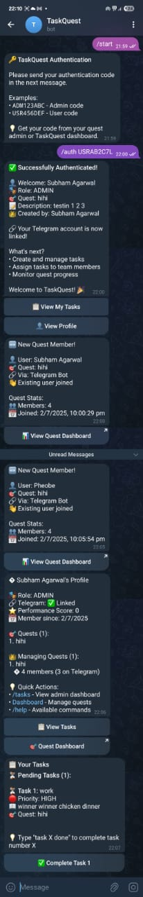
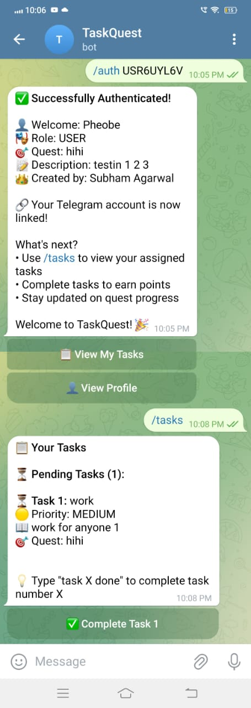

# TaskQuest: Gamified Team Task Management

TaskQuest is a multi-faceted task management platform that organizes work into quests and tasks, where admins can create quests and assign users and get updates of tasks. Similarly users can view their tasks and can update their status through both web interface and Telegram bot. It is designed for simple, structured team workflows with a focus on productivity and ease of access for task updates and creation.

## Screenshots

### Admin Dashboard & User Management

*Admin interface showing quest management, user controls, task assignment, and comprehensive dashboard features*

### Telegram Bot - User Authentication & Task Management  

*Complete Telegram bot workflow: authentication with codes, task viewing, quest details, and task completion*

**Key Bot Features Shown:**
- Secure authentication with generated codes
- User profile and role display
- Quest information and member management
- Task listing with priorities and status
- Interactive task completion
- Real-time updates and notifications

## Features
- **Quests & Tasks:** Organize work into quests, each with its own set of tasks and members
- **Telegram Bot Integration:** Full-featured bot for task management, authentication, and notifications
- **Multi-Platform Access:** Web dashboard and Telegram bot interface
- **Team Collaboration:** Add users to quests, assign tasks, and manage team roles
- **Real-time Notifications:** Get instant updates through Telegram for task assignments and completions
- **Authentication System:** Secure auth codes generated for Telegram linking with web accounts
- **GraphQL API:** Flexible API for frontend and integrations
- **Admin Controls:** Comprehensive admin panel for managing users, quests, and tasks
- **Session & Auth:** Secure authentication with JWT, sessions, and Firebase phone login
- **Modern UI:** EJS templates, Tailwind CSS, and responsive design

## Tech Stack
- **Backend:** Node.js, Express, Apollo Server (GraphQL), MongoDB (Mongoose)
- **Frontend:** EJS, Tailwind CSS
- **Auth:** JWT, Firebase, Sessions
- **Notifications:** Telegram Bot API(Botfather) and Telegraf
- **Dev Tools:** Nodemon, Concurrently, PostCSS, Render

## Getting Started
1. **Clone the repo:**
   ```sh
   git clone https://github.com/subhamagarrwal/TaskQuest.git
   cd TaskQuest
   ```
2. **Install dependencies:**
   ```sh
   npm install
   ```
3. **Configure environment:**
   - Copy `.env.example` to `.env` and fill in your MongoDB URI, session secret, and Firebase keys.
4. **Run in development:**
   ```sh
   npm run dev
   ```
   - This runs the server with live reload and watches Tailwind CSS.
5. **Build for production:**
   ```sh
   npm run build
   npm run start:prod
   ```

## Scripts
- `npm run dev` — Start dev server with nodemon and Tailwind watcher
- `npm run build` — Install dependencies (placeholder for build step)
- `npm run prod` — Start server in production mode
- `npm run watch` — Watch and build Tailwind CSS
- `npm run seed:botcommands` — Seed default bot commands to mongodb atlas


## Accessing the Bot
- **Bot Username:** `@taskquest_guardian_bot`
- Search for the bot on Telegram and start a chat to interact with it using the command `/start`
- **Bot Commands:** Use `/help` to see available commands and their usage
- **Authentication Flow:** 
  1. Get authentication code from admin or quest dashboard
  2. Send `/auth CODE` to the bot to link your Telegram account
  3. Access your tasks with `/tasks` command
  4. Complete tasks by typing "task X done" or using bot buttons
- **Features Available via Bot:**
  - View assigned tasks and quest details
  - Complete tasks with simple commands
  - Real-time progress updates
  - Quest status and member information
## Folder Structure
- `src/` — Main backend code (models, resolvers, schema, services, bot)
- `routes/` — Express REST API routes
- `views/` — EJS templates for UI
- `public/` — Static assets (CSS, JS, images)
- `TaskQuest/` — Project root (index.js, package.json, configs)

## Environment Variables
- `MONGO_URI` — MongoDB connection string
- `SESSION_SECRET` — Secret for session cookies
- `FIREBASE_*` — Firebase credentials for phone auth

## Contributing
Pull requests are welcome! For major changes, please open an issue first to discuss what you would like to change.

## License
ISC

---
For more details, see the main `README.md` or visit the [GitHub repo](https://github.com/subhamagarrwal/TaskQuest).
